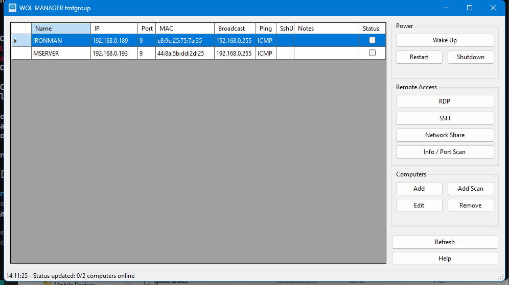
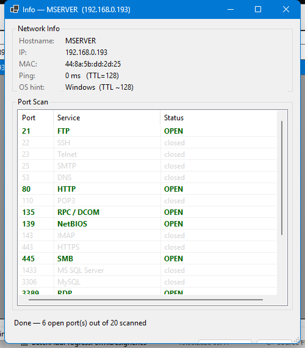
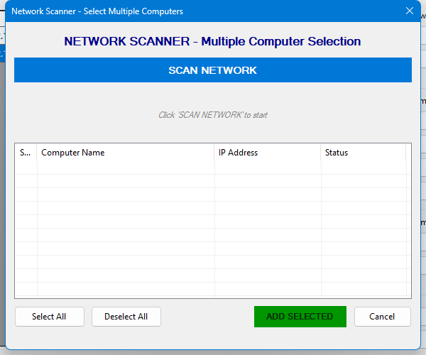

# WOL Manager

A Windows desktop tool for network administrators — Wake-on-LAN, remote power control, RDP, SSH, network share access, and port scanning, all in one place.



## Features

| Feature | Description |
|---|---|
| **Wake on LAN** | Sends magic packets through all active network interfaces (multi-homed / Hyper-V safe) |
| **Restart / Shutdown** | Remote power commands via `shutdown.exe` with confirmation dialog |
| **RDP** | Launches Remote Desktop Connection with one click |
| **SSH** | Opens Windows Terminal or cmd with `ssh [user@]host`; username saved per computer |
| **Network Share** | Browses `\\hostname` in Explorer; credential dialog on failure |
| **Info / Port Scan** | Pings host, detects OS from TTL, scans 20 common TCP ports in parallel |
| **Network Scanner** | Auto-discovers Windows computers on LAN (ping + ARP + hostname) |
| **System Tray** | Minimize to tray; balloon notification when a woken computer comes online |
| **Notes** | Free-text notes per computer (role, location, owner) |
| **Status polling** | Online / offline status refreshed every 10 seconds |

## Screenshots

### Info / Port Scan
Pings the target, guesses the OS from TTL, and scans 20 common TCP ports in parallel.



### Network Scanner
Auto-discovers active computers on the LAN — click **Scan Network**, tick the ones you want, and add them in bulk.



## Requirements

- Windows 10 / 11 (x64)
- [.NET 9 Desktop Runtime](https://dotnet.microsoft.com/download/dotnet/9.0)
- OpenSSH Client *(optional, for SSH)* — Settings → Apps → Optional features → OpenSSH Client

## Installation

Download `WOLManager-Setup-1.1.exe` from [Releases](../../releases/latest) and run it.  
The installer places files in `Program Files` (requires admin rights).  
Configuration is stored in `%APPDATA%\WOLManager\computers.json` — survives reinstalls and updates.

## Building from source

```
git clone https://github.com/toevi/WOLManager.git
cd WOLManager
dotnet build -c Release
```

Publish self-contained single-file exe:
```
dotnet publish -c Release -r win-x64 --self-contained true -p:PublishSingleFile=true -o publish
```

## Usage

1. **Add computers** — click **Add** (manual) or **Add Scan** (auto-discover)
2. **Wake a computer** — double-click the row, or select it and click **Wake Up**
3. **Remote access** — select a computer, then use **RDP / SSH / Network Share**
4. **Port scan** — select a computer, click **Info / Port Scan**
5. **Edit SSH username** — click **Edit**, fill in *SSH username* field — it will be used automatically next time

### Wake on LAN tips

- MAC address is required (`AA:BB:CC:DD:EE:FF`)
- WOL must be enabled in BIOS/UEFI and in the network adapter power management settings
- **Disable Fast Startup**: Control Panel → Power Options → Choose what the power buttons do → Turn on fast startup: **OFF**
- Works on the same LAN segment; for cross-subnet WOL configure directed broadcast on your router

### Remote Restart / Shutdown tips

- File and Printer Sharing must be enabled on the target
- Firewall rule **Remote Shutdown** must be active on the target
- You need administrator rights on the target machine

## Security

- All external processes launched via `ProcessStartInfo.ArgumentList` — no shell string interpolation
- SSH target validated with a strict regex before reaching any terminal emulator (blocks shell metacharacters even from attacker-controlled DNS hostnames)
- Port scan uses pure .NET `TcpClient.ConnectAsync` — no shell, no data read, port is a typed `int`
- Config stored in `%APPDATA%\WOLManager\` (not Program Files — no elevated writes at runtime)

## License

[MIT](LICENSE) — © 2025 tmfgroup
